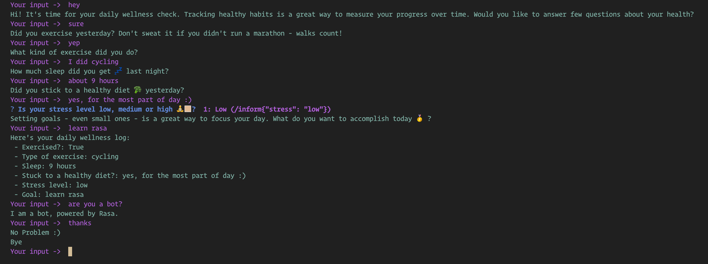

# Wellness Check Bot
[](https://rasa.com/docs/rasa/)

This is a simple Rasa bot that uses a form to create a daily log of health information. User is asked several health related questions and at the end the logs are shared back to the user. This project demonstrates use of [Forms](https://rasa.com/docs/rasa/forms) & [FormValidationAction](https://rasa.com/docs/rasa/forms#advanced-usage).

> **Note** : If you are looking for rasa version 1.x project files then head back to [master](https://github.com/kmanadkat/wellness-check-bot/tree/master) branch of this repository.


## Installation and Setup
It is recommended to use Python 3.6 or Python 3.7 with rasa framework. Below are the steps to setup virtual env, install rasa open source & running this project

1. Clone current branch & open it's root directory in terminal.

2. Create virtual env with python: `python3.7 -m venv ./venv` and activate it by `source ./venv/bin/activate`

3. [Install rasa](https://rasa.com/docs/rasa/installation) `pip install rasa`

### Generating Trained Model
Make sure python virtual env is active in terminal & you are good to train model.
```shell
rasa train
```

### Running Actions Server
After training is done, you need to run actions server to serve custom actions related computation.
```shell
rasa run actions
```

### Running Chatbot in Shell
Below command loads the trained model, opens communication to custom actions running server & provides [REPL](https://en.wikipedia.org/wiki/Read%E2%80%93eval%E2%80%93print_loop) to interact with chatbot.
```shell
rasa shell
```


